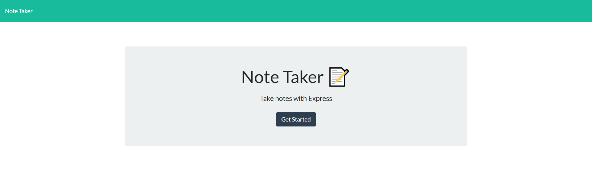

# Screenshots:

1. GIF of Entire App
   
2. Screenshot of Note Taking Welcome Screen
   
3. Screenshot of Note Taking App
   

# Main files:

- "Develop/db/db.json"
- "Develop/public/assets/css/styles.css"
- "Develop/public/assets/js/index.js"
- "Develop/public/index.html"
- "Develop/public/notes.html"
- "Develop/routes/routes.js"
- "Develop/server.js"

## Major Elements

Multiple moving parts in this assignment.

1. Server.js needs to have the right variable declarations, dependencies
2. Routes.js serves as the code to add/create/delete notes
3. db.json is the output where the json is stored after the user clicks save

### Installation and Setup

- Run 'npm i' before install
- Port is set to 3000, after running 'node server.js', open browser, and type 'localhost:3000'

© Tony Park 2021
